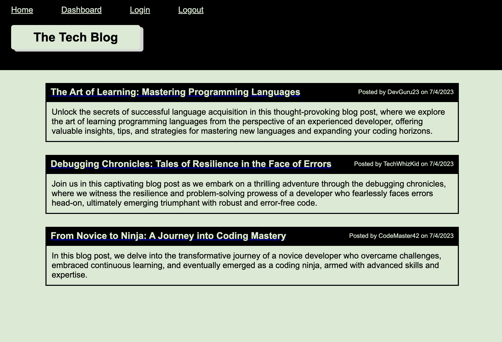

# CMS Site Blog

The displayed license badge is sourced from <a href="https://shields.io/category/license">Shields IO</a>.

## Description
The CMS Site Blog is an application that allows users to publish articles, blog posts, and their thoughts and opinions on various tech-related topics. It follows the Model-View-Controller (MVC) architectural pattern and utilizes technologies like Node.js, Express.js, Handlebars.js, and Sequelize ORM.

CMS blogs are an essential tool in today's digital landscape, offering developers and content creators a streamlined and efficient way to manage and publish online content. Furthermore, CMS blogs enhance user engagement and interaction through features like commenting. By leveraging the capabilities of CMS blogs, developers and content creators can focus on producing high-quality content, fostering engagement, and expanding their online presence.

## Table of Contents
* [Site](#site)
* [Repository](#repository)
* [Features](#features)
* [Usage](#usage)
* [Technologies Used](#technologies-used)
* [Contributing](#contributing)
* [Tests](#tests)
* [License](#license)
* [Resources](#resources)
* [Questions](#questions)

## Site
You can access the deployed site [here](placeholder). You can also view a screenshot of the site below:

## Repository
You can access the application's repository [here](https://github.com/MCunha17/cms-site-blog).

## Features
* Users can create an account by providing a username and password.
* Users can sign in to the application using their username and password.
* Users can log out of their account to end their session.
* When visiting the homepage, users can view existing blog posts, including the post title and creation date.
* Users can navigate to other sections of the application, such as the dashboard.
* Users can click on an existing blog post to view its details, including the post title, content, creator's username, and creation date.
* Signed-in users can leave comments on blog posts.
* Users can access their dashboard to view the blog posts they have created.
* Users can create a new blog post by providing a title and content.
* Users can edit and update their existing blog posts.
* Users can delete their blog posts.

## Usage
To install and use the project, follow these steps:

1. Clone the repository to your local machine.
2. Install the required dependencies.
3. Create an environment variable file and add your database name, MySQL username, and MySQL password.
4. Run the schema to create the development database.
5. Start the server by running the command to invoke the application.
6. Use the navigation links and buttons to explore the different features of the application. You can sign up for a new account, log in with your credentials, create blog posts, leave comments on posts, view and manage your dashboard, and log out when you're finished.

## Technologies Used
* JavaScript
* Node.js
* Express.js
* Express Handlebars
* MySQL2
* Sequelize
* Dotenv
* Bcrypt

## Contributing
If you would like to contribute to this project, please fork the repository and submit a pull request with your proposed contributions.

## License
This project is licensed under: MIT License.

## Tests
Currently, there are no tests implemented for this project. If you would like to contribute, please follow the [contributing guidelines](#contributing).

## Resources
The following resources were referenced to create this application:
* [MDN Web Docs: MVC](https://developer.mozilla.org/en-US/docs/Glossary/MVC)
* [Express: Using mmiddleware](https://expressjs.com/en/guide/using-middleware.html)
* [Templating with Handlebars cheat sheet](https://www.codecademy.com/learn/learn-handlebars/modules/templating-with-handlebars/cheatsheet)
* [npm: Express Handlebars](https://www.npmjs.com/package/express-handlebars)
* [npm: bcrypt](https://www.npmjs.com/package/bcrypt)
* [Sequelize: Model](https://sequelize.org/api/v6/class/src/model.js~model)
* [W3 Schools: JavaScript Cookies](https://www.w3schools.com/js/js_cookies.asp)
* [W3 Schools: WebSecurity - RequireAuthenticatedUser()](https://www.w3schools.com/asp/met_websecurity_requireauthenticateduser.asp)
* [W3 Schools: HTTP Request Methods](https://www.w3schools.com/tags/ref_httpmethods.asp)

## Questions
If you have any questions, please visit my GitHub profile [MCunha17](https://github.com/MCunha17) or contact me at cunha.maria.theresa@gmail.com.